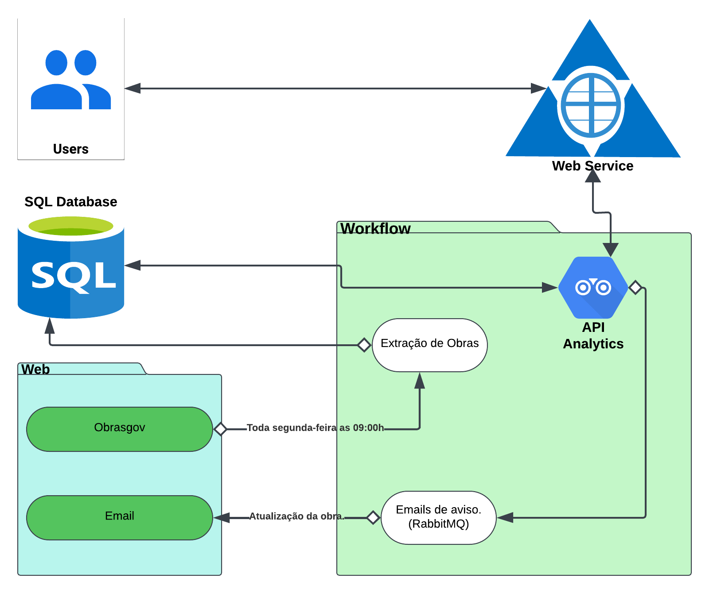

## **Introdução**

O MonitoraBSB é um sistema de monitoramento e análise voltado para acompanhar indicadores de diversas obras situadas no Distrito Federal. O objetivo é fornecer uma plataforma web onde os usuários possam filtrar, visualizar e analisar dados relacionados a diferentes aspectos da cidade. 

Este documento descreve a arquitetura do sistema, abordando os principais componentes e a interação entre eles. A arquitetura adotada segue o padrão MVC (Model-View-Controller) garantindo uma melhor experiência do usuário e alinhamento com os requisitos do projeto, conforme detalhado a seguir.

---

## **Diagrama de Arquitetura**

---

## **Componentes Principais**
1. **Users (Usuários):**
    - Representa os consumidores finais que interagem com o sistema.
    - Acessam os dados e as funcionalidades fornecidas pela aplicação.

2. **Banco de Dados (SQL):**
    - Responsável por armazenar os dados de obras e atualizações.
    - Interage com o fluxo de trabalho para armazenar e recuperar informações extraídas.

3. **Web:**
    - **Obrasgov:** Fonte de informações sobre as obras. Realiza a extração semanal, às segundas-feiras, às 09:00h.
    - **Email:** Sistema para envio de atualizações relacionadas às obras. Utiliza RabbitMQ para o envio de notificações.

4. **Workflow (Fluxo de Trabalho):**
    - **Extração de Obras:** Obtém informações do sistema "Obrasgov" e as processa.
    - **API Analytics:** Integra-se ao sistema analítico para análises avançadas das informações extraídas.
    - **Emails de Aviso (RabbitMQ):** Envia notificações para os usuários quando há atualização de obras.

5. **API Analytics:**
    - Serviço especializado em análises e processamento de dados.
    - Atua como ponto central de comunicação entre o Workflow e os usuários.

---

## **Fluxo de Dados**

1. **Extração de Dados:**
    - O sistema "Obrasgov" realiza a extração de dados de obras semanalmente, às 09:00h.
    - Os dados extraídos são enviados ao Workflow para processamento.

2. **Processamento e Armazenamento:**
    - O Workflow armazena os dados extraídos no banco SQL.
    - A API Analytics analisa e processa os dados armazenados.

3. **Notificação e Acesso:**
    - Atualizações nas obras geram notificações por meio do sistema de email (RabbitMQ).
    - Os usuários acessam os dados processados pela API Analytics.

---

## **Detalhes Técnicos**

- **Agendamento de Tarefas:**
    - A extração de obras é automatizada e ocorre semanalmente.
  
- **Mensageria:**
    - RabbitMQ é utilizado para gerenciar filas de envio de notificações.

- **Análise de Dados:**
    - A API Analytics fornece insights baseados nos dados processados.

---

## **Tecnologias Utilizadas**
- **Frontend:** React
- **Backend:** Flask 
- **API:** Obras.gov
- **Banco de Dados:** PostgreSQL

---

 Autores: Daniel Nunes Duarte e Beatriz Lins 

